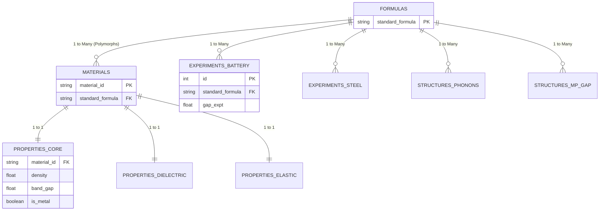

# NEDGEX Data Architecture & Relational Schema

This document outlines the Star Schema relational database architecture implemented by the `DataTransformer` ETL pipeline. This pipeline normalizes raw Materials Science datasets into a cleansed SQLite database (`data/materials.db`), ensuring reliable table joins and correlation analytics.

## Core Problem Solved: Formulas vs. Materials
In Materials Science, a chemical formula (e.g., `C`) does not uniquely identify a material, because a single formula can have multiple polymorphs (e.g., Diamond vs. Graphite) which have completely different crystal structures and physical properties. 

To prevent data corruption and duplicate joins, this schema strictly separates datasets into two categories:
1. **Material-Specific Data**: Data tied to a specific crystal structure (`material_id`).
2. **Formula-Specific Data**: Experimental data tied only to a bulk composition (`standard_formula`), where the specific crystal structure is unknown or irrelevant.

---

## Entity-Relationship Diagram



---

## 1. Master Tables

### `formulas`
The root lookup table for all chemical compositions. Every formula across every dataset is passed through `pymatgen.core.Composition().reduced_formula` to guarantee alphabetical, reduced standardization (e.g., `CoLiO2` becomes `LiCoO2`).
* **Primary Key:** `standard_formula` (String)

### `materials`
The root lookup table for specific crystal structures.
* **Primary Key:** `material_id` (String, e.g., `mp-149`)
* **Foreign Key:** `standard_formula` -> `formulas.standard_formula`
* **Relationship:** Many-to-One with `formulas`. (One formula can have multiple material polymorphs).

---

## 2. Material-Specific Properties (1:1 Relationships)
These tables contain properties calculated via Density Functional Theory (DFT) for a *specific crystal structure*. They must be joined via `material_id`.

### `properties_core`
Fundamental macroscopic and thermodynamic properties from the Materials Project.
* **Foreign Key:** `material_id` -> `materials.material_id`
* **Fields:** `density`, `band_gap`, `is_metal`, `formation_energy_per_atom`, `energy_above_hull`, `volume`, `theoretical`, `crystal_system`

### `properties_dielectric`
Dielectric tensors and refractive indices.
* **Foreign Key:** `material_id` -> `materials.material_id`
* **Fields:** `e_electronic`, `e_total`, `n`, `poly_electronic`, `poly_total`, `pot_ferroelectric`

### `properties_elastic`
Mechanical and elastic tensors.
* **Foreign Key:** `material_id` -> `materials.material_id`
* **Fields:** `elastic_anisotropy`, `G_Reuss`, `G_VRH`, `G_Voigt`, `K_Reuss`, `K_VRH`, `K_Voigt`, `poisson_ratio`, `compliance_tensor`, `elastic_tensor`

---

## 3. Formula-Specific Properties (1:N Relationships)
These tables contain experimental observations or properties tied to a chemical composition. They must be joined via `standard_formula`.

### `experiments_battery`
Experimental band gaps relevant for battery screening.
* **Primary Key:** `id`
* **Foreign Key:** `standard_formula` -> `formulas.standard_formula`
* **Fields:** `gap expt`

### `experiments_steel`
Mechanical properties of steel alloys.
* **Primary Key:** `id`
* **Foreign Key:** `standard_formula` -> `formulas.standard_formula`
* **Fields:** `yield strength`, `tensile strength`, `elongation`, plus 13 elemental weight-percentage columns (`c`, `mn`, `cr`, etc.).

---

## 4. Derived Structure Datasets (1:N Relationships)
These massive datasets originate from Matbench and contain raw 3D atomic structure JSON arrays. The ETL pipeline mathematically extracts the `standard_formula` from the atomic sites in the JSON array, allowing them to be joined to the master tables.

### `structures_phonons`
Highest frequency optical phonon modes.
* **Primary Key:** `id`
* **Foreign Key:** `standard_formula` -> `formulas.standard_formula`
* **Fields:** `structure` (Raw JSON), `last phdos peak`

### `structures_mp_gap`
A massive matrix (100k+ records) mapping PBE band gaps to structures.
* **Primary Key:** `id`
* **Foreign Key:** `standard_formula` -> `formulas.standard_formula`
* **Fields:** `structure` (Raw JSON), `gap pbe`

---

## Data Science Query Guidelines

### Example 1: Correlating Core Properties with Dielectric Properties
Join using `material_id`:
```sql
SELECT 
    m.standard_formula,
    c.density,
    d.e_total
FROM materials m
JOIN properties_core c ON m.material_id = c.material_id
JOIN properties_dielectric d ON m.material_id = d.material_id;
```

### Example 2: Correlating Battery Experiments with Matbench Gaps
Join using `standard_formula`:
```sql
SELECT 
    f.standard_formula,
    b.`gap expt` as experimental_gap,
    p.`gap pbe` as calculated_gap
FROM formulas f
JOIN experiments_battery b ON f.standard_formula = b.standard_formula
JOIN structures_mp_gap p ON f.standard_formula = p.standard_formula;
```
