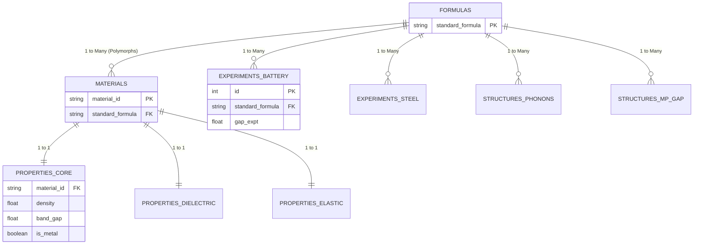

# Materials Intelligence Dataset Documentation

This document describes the datasets exported and compiled by the NEDGEX Data Importer. This data is structured and ready for exploratory data analysis (EDA), correlation analytics, and predictive ML modeling.

---

# PART I: Raw Datasets

## 1. Core Materials Dataset
**Source:** Materials Project API (`mp-api`)  
**Filename:** `core_materials.csv`  
**SQLite Table:** `properties_core`
**Size:** ~19.44 MB  |  **Records:** 154,879  
**Description:** A comprehensive snapshot of the Materials Project database containing fundamental macroscopic, electronic, and structural properties of crystalline materials.

**Fields (in SQLite `properties_core`):**
- `material_id`: Unique identifier from Materials Project (Foreign Key).
- `density`: Calculated physical density (g/cm³).
- `band_gap`: Energy band gap in electron-volts (eV).
- `is_metal`: Boolean flag indicating if the material is metallic.
- `formation_energy_per_atom`: Thermodynamic stability metric.
- `energy_above_hull`: Decomposition energy metric.
- `volume`: Unit cell volume.
- `theoretical`: Boolean flag indicating if the structure is purely theoretical or experimentally observed.
- `crystal_system`: Structural classification (e.g., Cubic, Monoclinic).

---

## 2. Experimental Battery Band Gaps
**Source:** Matbench / Matminer (`matbench_expt_gap`)  
**Filename:** `battery_materials.csv`  
**SQLite Table:** `experiments_battery`
**Size:** ~0.06 MB  |  **Records:** 4,604  
**Description:** Experimental band gaps of various materials, highly relevant for screening electrolytes and battery components.

**Fields (in SQLite `experiments_battery`):**
- `id`: Auto-generated integer primary key.
- `standard_formula`: Standardized chemical formula (Foreign Key).
- `composition`: Original chemical composition string.
- `gap expt`: The experimentally observed band gap.

---

## 3. Dielectric Constant Dataset
**Source:** Matminer / Figshare (`dielectric_constant`)  
**Filename:** `dielectric_constant.csv`  
**SQLite Table:** `properties_dielectric`
**Size:** ~5.87 MB  |  **Records:** 86,075  
**Description:** Tensorial and scalar dielectric properties of materials, useful for identifying novel insulators or capacitors.

**Fields (in SQLite `properties_dielectric`):**
- `material_id`: Foreign Key linking to `materials` table.
- `formula`, `nsites`, `space_group`, `volume`, `band_gap`: Additional structural metadata.
- `e_electronic`: Electronic contribution to dielectric constant.
- `e_total`: Total dielectric constant.
- `n`: Refractive index.
- `poly_electronic`, `poly_total`: Polycrystalline averages.
- `pot_ferroelectric`: Potential ferroelectric flag.
*(Note: `structure`, `cif`, `meta`, and `poscar` columns were dropped during ETL).*

---

## 4. Elasticity Dataset (2015)
**Source:** Matminer / Figshare (`elastic_tensor_2015`)  
**Filename:** `elastic_tensor_2015.csv`  
**SQLite Table:** `properties_elastic`
**Size:** ~5.58 MB  |  **Records:** 144,854  
**Description:** Mechanical and elastic properties calculated via DFT.

**Fields (in SQLite `properties_elastic`):**
- `material_id`: Foreign Key linking to `materials` table.
- `formula`, `nsites`, `space_group`, `volume`: Additional structural metadata.
- `elastic_anisotropy`: Measure of directional mechanical dependence.
- `G_Reuss`, `G_VRH`, `G_Voigt`: Shear moduli bounds.
- `K_Reuss`, `K_VRH`, `K_Voigt`: Bulk moduli bounds.
- `poisson_ratio`: Ratio of transverse to axial strain.
- `compliance_tensor`, `elastic_tensor`, `elastic_tensor_original`: Full tensorial data.
- `kpoint_density`: Density of k-points grid.
*(Note: `structure`, `poscar`, and `cif` columns were dropped during ETL).*

---

## 5. Matbench Phonons
**Source:** Matbench / Matminer (`matbench_phonons`)  
**Filename:** `matbench_phonons.csv`  
**SQLite Table:** `structures_phonons`
**Size:** ~0.71 MB  |  **Records:** 19,641  
**Description:** Highest frequency optical phonon mode peak (useful for thermal conductivity analytics).

**Fields (in SQLite `structures_phonons`):**
- `id`: Auto-generated integer primary key.
- `standard_formula`: Standardized chemical formula parsed from the structure JSON (Foreign Key).
- `structure`: JSON/Dict representation of the crystal structure.
- `last phdos peak`: The highest frequency peak in the phonon density of states.

---

## 6. Matbench MP Gap
**Source:** Matbench / Matminer (`matbench_mp_gap`)  
**Filename:** `matbench_mp_gap.csv`  
**SQLite Table:** `structures_mp_gap`
**Size:** ~180.36 MB  |  **Records:** 4,033,888 (incl. structure string representations)  
**Description:** A massive dataset correlating structural inputs to DFT-calculated PBE band gaps.

**Fields (in SQLite `structures_mp_gap`):**
- `id`: Auto-generated integer primary key.
- `standard_formula`: Standardized chemical formula parsed from the structure JSON (Foreign Key).
- `structure`: JSON/Dict representation of the crystal structure.
- `gap pbe`: PBE calculated band gap.

---

## 7. Steel Strength
**Source:** Matminer / Figshare (`steel_strength`)  
**Filename:** `steel_strength.csv`  
**SQLite Table:** `experiments_steel`
**Size:** ~0.06 MB  |  **Records:** 312  
**Description:** Experimental mechanical properties of various steel alloys based on their elemental composition.

**Fields (in SQLite `experiments_steel`):**
- `id`: Auto-generated integer primary key.
- `standard_formula`: Standardized chemical formula (Foreign Key).
- `formula`: Original alloy formula string.
- Elements: `c`, `mn`, `si`, `cr`, `ni`, `mo`, `v`, `n`, `nb`, `co`, `w`, `al`, `ti` (Weight percentages of alloying elements).
- `yield strength`: Yield stress.
- `tensile strength`: Ultimate tensile strength.
- `elongation`: Ductility metric.

---

# PART II: Transformed & Relational Schema (Star Schema)

Following the ETL pipeline transformation, the raw datasets above are no longer isolated CSVs. They have been tightly integrated into a **Star Schema** within `data/materials.db` to allow seamless correlation analytics. 

## 1. Master Formulas (Generated)
**Source:** NEDGEX ETL Pipeline (`data_transformer.py`)  
**Table:** `formulas` (SQLite)  
**Records:** 107,408  
**Description:** The centralized root lookup table for all unique chemical compositions across every dataset. The pipeline standardizes every formula into a reduced alphabetical string using `pymatgen` to guarantee 100% accurate JOINs.

**Fields:**
- `standard_formula`: Primary Key (e.g., `LiCoO2`).

## 2. Master Materials (Generated)
**Source:** NEDGEX ETL Pipeline (`data_transformer.py`)  
**Table:** `materials` (SQLite)  
**Records:** 154,879  
**Description:** The master mapping table linking specific structural polymorphs to their parent formula. 

**Fields:**
- `material_id`: Primary Key (from Materials Project, e.g., `mp-149`).
- `standard_formula`: Foreign Key linking to the `formulas` table.

### Entity-Relationship Diagram



**The Golden Rule of Materials Science Data:** A chemical formula (e.g., `C`) does not uniquely identify a material. It can be graphite, diamond, etc. Therefore, the tables are strictly segregated into two correlation paths:

### List of Tables by Category

**Master Tables (The Hub)**
*   `formulas`: Master list of all unique standardized chemical formulas.
*   `materials`: List of specific crystal structures (mapped to `material_id`).

**Material-Specific Properties (1:1 with `materials`)**
*   `properties_core`: Basic properties like density, band gap, and stability.
*   `properties_dielectric`: Dielectric tensors and refractive indices.
*   `properties_elastic`: Elastic and mechanical tensors.

**Experimental & Structural Data (1:N with `formulas`)**
*   `experiments_battery`: Experimental band gap measurements.
*   `experiments_steel`: Mechanical properties of various steel alloys.
*   `structures_phonons`: Phonon vibrational modes.
*   `structures_mp_gap`: A large dataset of calculated band gaps mapped to 3D structures.

### Path A: Material-Specific Correlations (1:1 Joins)
Use **`material_id`** to join tables that describe specific crystal structures.
*   **`materials`**: The master lookup table mapping `material_id` to its parent `standard_formula`.
*   **`properties_core`**, **`properties_dielectric`**, **`properties_elastic`**: These tables are 1:1 with `materials`. 
*   **Query Example:** To correlate elastic anisotropy with band gaps:
    ```sql
    SELECT c.band_gap, e.elastic_anisotropy 
    FROM properties_core c 
    JOIN properties_elastic e ON c.material_id = e.material_id;
    ```

### Path B: Formula-Specific Correlations (1:N Joins)
Use **`standard_formula`** to join experimental or structural datasets where the specific polymorph `material_id` is unknown or irrelevant.
*   **`formulas`**: The master lookup table for all unique standardized compositions (e.g., `LiCoO2`).
*   **`experiments_battery`**, **`experiments_steel`**, **`structures_phonons`**, **`structures_mp_gap`**: These tables are 1:N with `formulas`.
*   **Query Example:** To correlate calculated PBE gaps with experimental battery gaps:
    ```sql
    SELECT b.`gap expt`, p.`gap pbe` 
    FROM experiments_battery b 
    JOIN structures_mp_gap p ON b.standard_formula = p.standard_formula;
    ```

---

## Data Science Recommendations
-   **Direct Database Queries:** Do not parse the raw CSVs. Connect directly to `data/materials.db` using Python's `sqlite3` or `sqlalchemy` and `pandas.read_sql()`. The ETL pipeline has already cleansed and standardized all formula strings for you.
-   **Structural Featurization:** If you are building ML models using the `structures_phonons` or `structures_mp_gap` tables, you will need to parse the JSON `structure` strings using `pymatgen` and featurize them using `matminer` (e.g., `SineCoulombMatrix` or `SiteStatsFingerprint`) before training.
